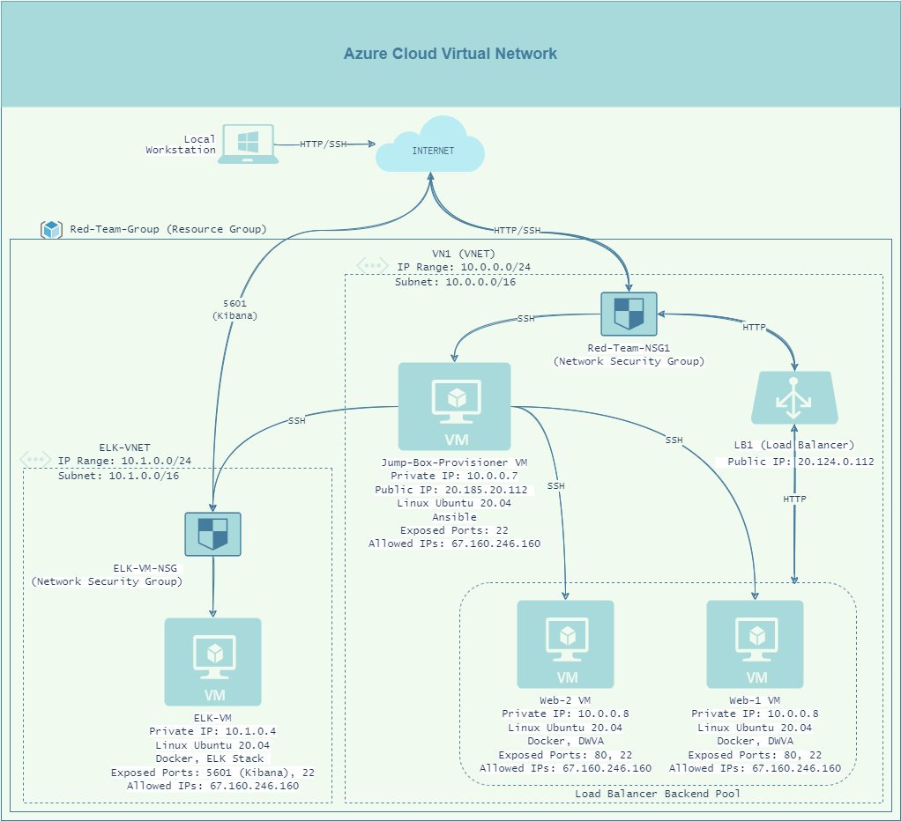

## Automated ELK Stack Deployment

The files in this repository were used to configure the network depicted below.

These files have been tested and used to generate a live ELK deployment on Azure. They can be used to either recreate the entire deployment pictured above. Alternatively, select portions of the YAML playbook file may be used to install only certain pieces of it, such as Filebeat.

  - [The Install ELK playbook](Ansible/install-elk.yml)

This document contains the following details:
- Description of the Topology
- Access Policies
- ELK Configuration
  - Beats in Use
  - Machines Being Monitored
- How to Use the Ansible Build

### Description of the Topology

The main purpose of this network is to expose a load-balanced and monitored instance of DVWA, the D*mn Vulnerable Web Application.

Load balancing ensures that the application will be highly available, in addition to restricting unauthorized traffic to the network.

Load balancers protect the availability of networks by helping to prevent Denial-of-Service by balancing traffic between different machines and applying rules. The advantages of using a jump box include efficient management of multiple machines as well as fast and easy deployment of web servers. 

Integrating an ELK server allows users to easily monitor the vulnerable VMs for changes to the log files and system metrics.
- Filebeat watches log files and relays any logged events that have specified characteristics.
- Metricbeat records metric data sourced from system services.

The configuration details of each machine may be found below.

| Name     | Function | IP Address | Operating System |
|----------|----------|------------|------------------|
| Jump Box | Gateway  | 10.0.0.7   | Linux            |
| Web-1    | DVWA     | 10.0.0.8   | Linux            |
| Web-2    | DVWA     | 10.0.0.6   | Linux            |
| ELK-VM   | ELK Stack| 10.1.0.4   | Linux            |

### Access Policies

The machines on the internal network are not exposed to the public Internet. 

Only the Jump Box machine can accept connections from the Internet. Access to this machine is only allowed from the following IP addresses:
- 67.160.246.160 (my personal public IP address)

Machines within the network can only be accessed by the Jump Box VM.
- The Jump Box VM (10.0.0.7) is allowed to access the ELK VM via an Ansible container configuration.

A summary of the access policies in place can be found in the table below.

| Name     | Publicly Accessible | Allowed IP Addresses |
|----------|---------------------|----------------------|
| Jump Box | No                  | My IP Address        |
| Web-1    | No                  | My IP Address        |
| Web-2    | No                  | My IP Address        |
| ELK-VM   | Yes                 | My IP Address        |

### Elk Configuration

Ansible was used to automate configuration of the ELK machine. No configuration was performed manually, which is advantageous because it expedites the proscess as well as lowers the possibility of user error. It also allows for a relatively simple troubleshooting process if any problems arise, as well as great potential for scalability in that it can configure many machines at once.

The playbook implements the following tasks:

- First, installs are conducted for docker.io, python3-pip, and the Docker module.
- Subsequently, virtual memory is increased and allocated to the ELK VM.
- After, the Docker ELK container is downloaded and launched.
- The playbook then uses `systemctl` to enable the Docker service to run on boot.

The following screenshot displays the result of running `docker ps` after successfully configuring the ELK instance.

### Target Machines & Beats
This ELK server is configured to monitor the following machines:
- Web-1: 10.0.0.8
- Web-2: 10.0.0.6

We have installed the following Beats on these machines:
- Filebeat
- Metricbeat

These Beats allow us to collect the following information from each machine:

- `Filebeat` collects system logs and looks for changes to files such as authorization logs in specified locations, while `Metricbeat` collects system metrics such as CPU usage, memory usage, uptime, as well as system services statistics.

### Using the Playbook
In order to use the playbook, you will need to have an Ansible control node already configured. Assuming you have such a control node provisioned: 

SSH into the control node and follow the steps below:
- Copy the [Install-elk.yml](Ansible/install-elk.yml) playbook to /etc/ansible/ in the container.
- Update the /ansible/hosts file to include Web VM and ELK VM IP addresses. In order to ensure the correct machines will be configured with Filebeat, Metricbeat, or ELK, the Web VM IPs must be placed under the `[webservers]` line, while the ELK VM IP should be placed under the `[elk]` line.
- Run the playbook, and navigate to the Kibana web page [http://13.64.212.35:5601/app/kibana] to check that the installation worked as expected.

_As a **Bonus**, provide the specific commands the user will need to run to download the playbook, update the files, etc._
